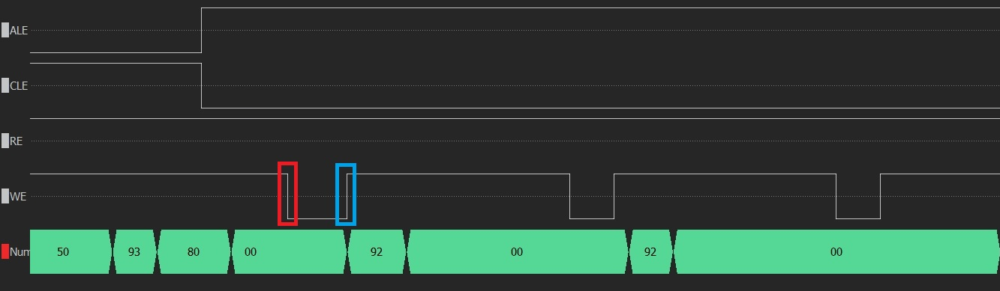

# Summary
Below are my notes showing observed anomalies.

# WE signal with short timing
See bus capture (FTDI div 5 clock mode!), on first byte (technically it is first byte of addreess) data validity ends at the rising edge.

There is a difference between the NAND WE signal and FTDI Host Bus Emulation signal WR.
NAND reacts on rising edge and FTDI assumes that the slave reacts on falling edge of the RD and WR signals.
Technically edges comes in pairs, in many case using the second edge is fine, but since FTDI
does not care about bus validity after rising edge, NAND may not read the correct value.
Comparing datasheets:

NAND requires data valid for tDH time equals 10ns (for K9F2808).

FTDI holds data for t7+t8= 2cycles, at 60MHz it would be ~32ns.

**Reason unknown.**

In the application code, difference between first byte and other butes is this byte is transfered as Write Extended Address (opcode 0x93), following bytes are Short Address Writes (opcode 0x92).
However this does not explain why the data is not hold longer.

# Strange data response around edges of RE

See bus capture, NAND chip outputs data just before the falling edge of RE, then holds output during rising edges and then 40ns later emits some data.
Data received before falling edge is 0x90 in 95% bytes, "late" data is ussually 0x00, with rare other values.

**Reason unknown.**

NAND chip may be faulty, but it responds correctly for Read ID command and answers 30ns after falling edge of RE. See below.

